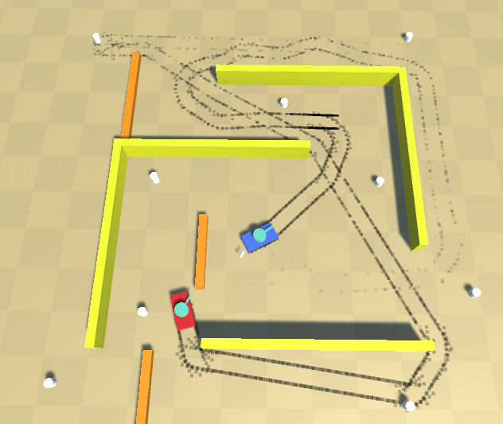

# WeeTank
a project similar to wii tanks

## Done:
  - detect visibility to target
  - use navmesh
  - separate MOVE target and AIM target for tanks :) 
  - win/lose (game over) condition and (re)start (next) level
  - fade in, fade out, UI feedback ("GAME OVER", "VICTORY!")
  - multiple levels
  
  - hits to actually deal damage, destroy tanks
  
    - FULL WALLS that block everything: movement, visibility, shooting
    - HALF walls that block movement but allow visibilityand shooting
    - DESTRUCTABLE (full) walls (by shooting)
    
    - Audio: firing, explosion, tank engine, tracks, turret turn, reload, ...
    
    - destroyed tanks should leave at least a mark
    
- same screen multiplayer (co-op vs AIs, PvP)
  - gamepad input
  - test in Parsec  
  
## ToDo:
- AI: stop pushing walls. options/parts
  - detect collision to wall/obstacle or being held back, and do something about it
- stop tanks turning over
  - change movement to use physics forces instead of small teleports
- multiple AI types/levels (behaviour, regardless of what tank it's driving)
  - how aggressive it is vs how defensive,
  - visibility range,
  - reaction time,
  - etc

- keep working on new AI

- LEVELS!
  - need a list of potential level ideas (enough to throw away some if they are not good enough) and start blocking them out
    - forest
    - village
    - town
    - factory
    - bridge
    - ...
  - also think about the different gameplay mechanics different obstacles create or promote. We have...
  
  - COULD have...
    - destructable half walls?
    - "holes" that blocks movement but allows shooting like half walls, but cannot be destroyed
    - walls that can be destroyed by driving into
    - "mud" that allows movement but slows it down
    - ...

- Graphics 
  - models: for tank bodies, turrets, barrels
  - textures (at least ground)
- Audio: bounce
- VFX: firing, bullet trails, smoke, sparks, dynamic lights (e.g explosion), hitmarks, etc
- destroyed tanks should leave at least a mark
  - but maybe even stay there as wreck?

- destructable walls* (* trees, etc)
  - walls that can be destroyed by driving into
  - maybe, full walls could turn into half walls when damaged?
  - could half walls be destroyed?
  - "holes": ground you can see over and shoot over but cannot move across
  - "mud": same but only slows you down

- powerups OR upgrades between rounds
  - tank: max speed, acceleration, deceleration, turn rate, turn acceleration(momentum), max speed while turning(!)
  - turret: turn rate, turn acceleration, fire rate (reload)
  - cannon?
  - bullet: speed, lifetime, bounces, damage, AOE, ...

- Question: visibility for players? i.e. hide enemy tanks that are not visible

- DAMAGE SYSTEM DESIGN!
  - Should bullets remain single-hit kill? Probably not. 
  - Should they have infinite ammo? Probably yes. :)
  - It would be interesting if bullets wouldn't always deal the same damage, but have a chance* to deal damage, like in an RPG: hit/miss/critical, random* value, so upgrades (to both bullets/cannon and to armor) could affect the range and probabilities of how much damage an impact deals :)
  - Should tank have a simple total "health", or should they receive damage to specific parts/functionalities? Could create more heroic fights and "near misses" :) Decreased movement speed, turn speed, turn limited to one way, no reverse or no forwards, getting immobilised, turret rotation speed, reload time, etc :)
  - Should they have some kind of repair? Either built into the tank ("self-heal"), powerup, or repair points between levels, etc?
  
  - For the FEEL, add a tiny DELAY when a bullet hits a tank, before it explodes ...or not :)
